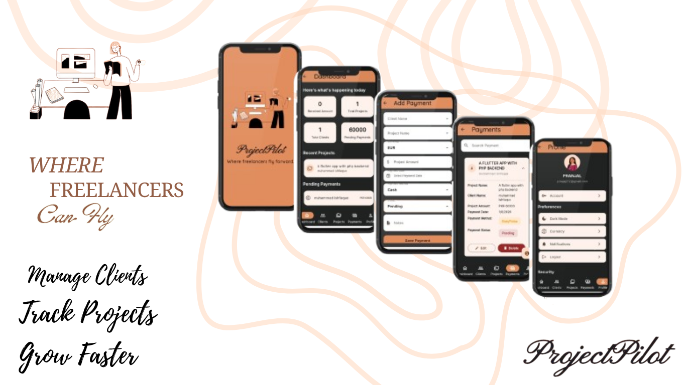
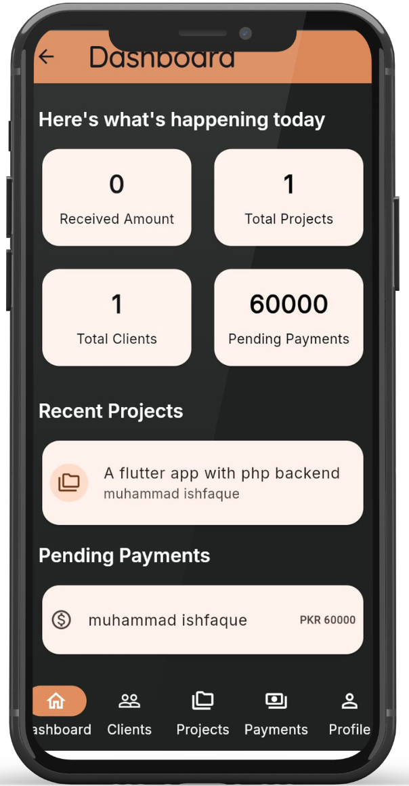
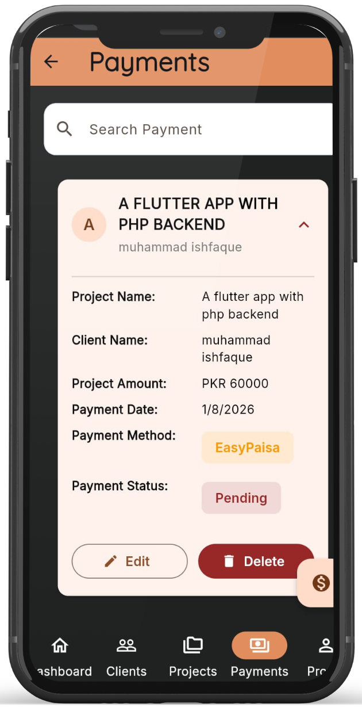
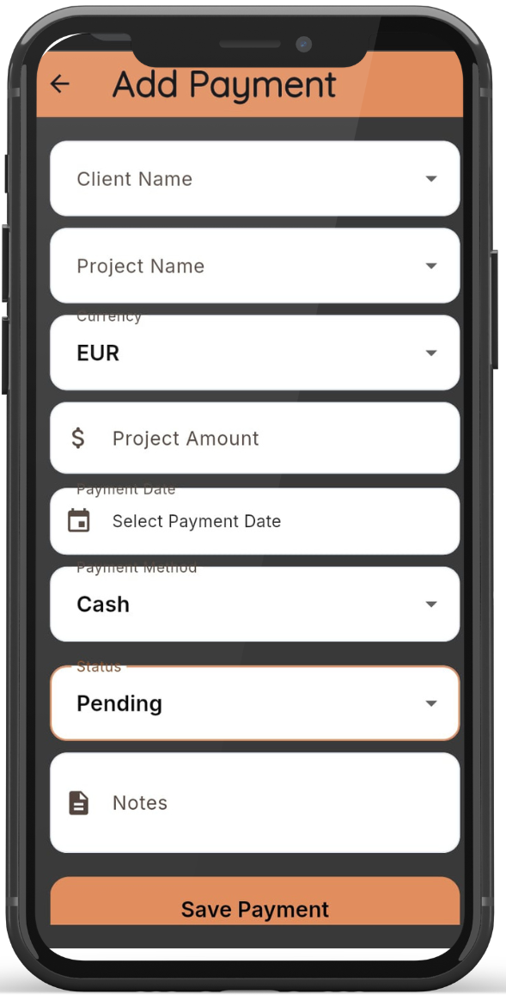
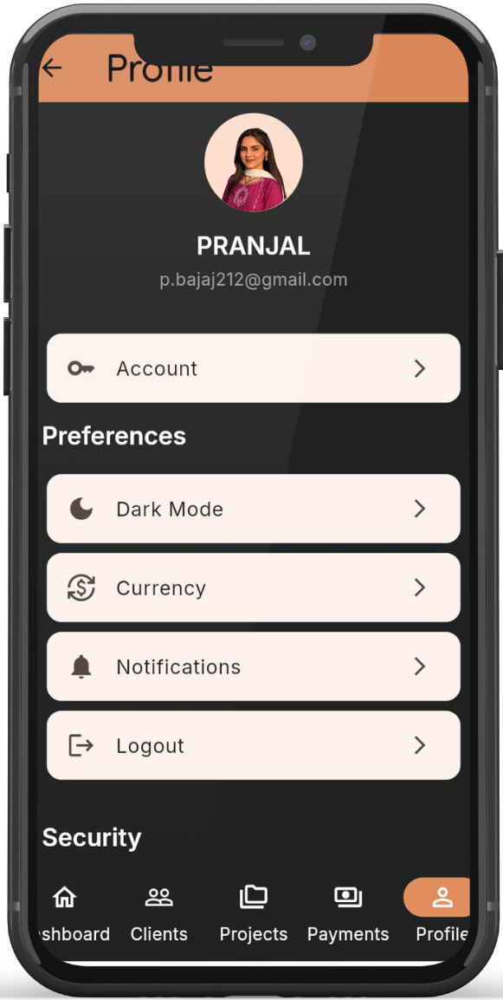

# ProjectPilot 

It is a  Freelance Client Management application designed to help freelancers organize their clients, projects, and payments in one place.

## Screenshots

  
  
  

  
  

## ✨ Features
- 🔐 Firebase Authentication
- 👥 Client Management (CRUD)
- 📁 Project Management linked with clients
- 💳 Payment Tracking
- 📊 Dashboard with live statistics
- 👤 User Profile & Account Management
- 🌙 Light & Dark Theme Support
- 🔍 Search Functionality
- ☁️ Cloud Firestore Integration
- 📱 Responsive UI for Mobile & Desktop

## 🛠 Tech Stack

- Flutter - Dart - Firebase Authentication - Cloud Firestore - Provider - GoRouter - Material 3

